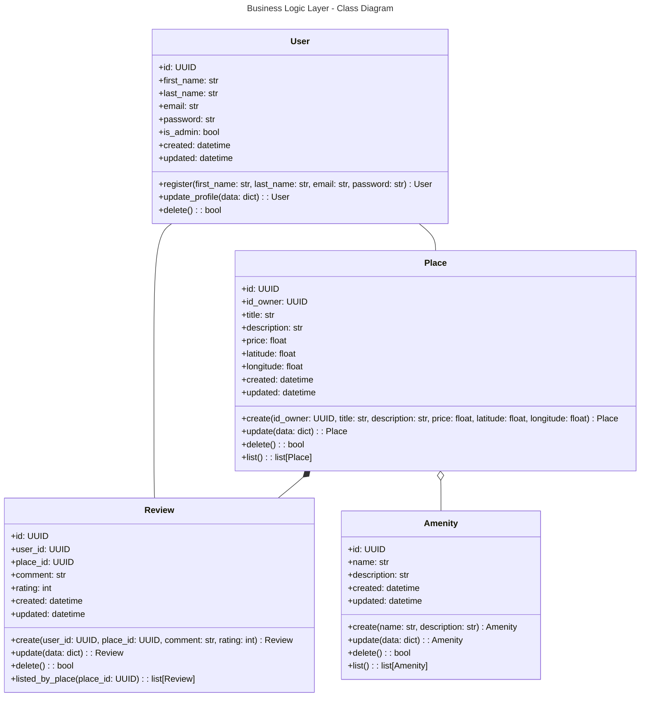

```mermaid
---
title: Business Logic Layer - Class Diagram
---
classDiagram
class User {
    +id: UUID
    +first_name: str
    +last_name: str
    +email: str
    +password: str
    +is_admin: bool
    +created: datetime
    +updated: datetime
    +register(first_name: str, last_name: str, email: str, password: str) User
    +update_profile(data: dict): User
    +delete(): bool
}
class Place {
    +id: UUID
    +id_owner: UUID
    +title: str
    +description: str
    +price: float
    +latitude: float
    +longitude: float
    +created: datetime
    +updated: datetime
    +create(id_owner: UUID, title: str, description: str, price: float, latitude: float, longitude: float) Place
    +update(data: dict): Place
    +delete(): bool
    +list(): list[Place]
}
class Review {
    +id: UUID
    +user_id: UUID
    +place_id: UUID
    +comment: str
    +rating: int
    +created: datetime
    +updated: datetime
    +create(user_id: UUID, place_id: UUID, comment: str, rating: int) Review
    +update(data: dict): Review
    +delete(): bool
    +listed_by_place(place_id: UUID): list[Review]
}
class Amenity {
    +id: UUID
    +name: str
    +description: str
    +created: datetime
    +updated: datetime
    +create(name: str, description: str) Amenity
    +update(data: dict): Amenity
    +delete(): bool
    +list(): list[Amenity]
}

User -- Place
User -- Review
Place *-- Review
Place o-- Amenity
```
