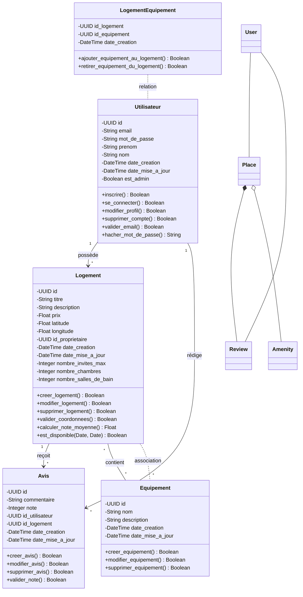

```mermaid
classDiagram
    class Utilisateur {
        -UUID id
        -String email
        -String mot_de_passe
        -String prenom
        -String nom
        -DateTime date_creation
        -DateTime date_mise_a_jour
        -Boolean est_admin
        +inscrire() Boolean
        +se_connecter() Boolean
        +modifier_profil() Boolean
        +supprimer_compte() Boolean
        +valider_email() Boolean
        +hacher_mot_de_passe() String
    }

    class Logement {
        -UUID id
        -String titre
        -String description
        -Float prix
        -Float latitude
        -Float longitude
        -UUID id_proprietaire
        -DateTime date_creation
        -DateTime date_mise_a_jour
        -Integer nombre_invites_max
        -Integer nombre_chambres
        -Integer nombre_salles_de_bain
        +creer_logement() Boolean
        +modifier_logement() Boolean
        +supprimer_logement() Boolean
        +valider_coordonnees() Boolean
        +calculer_note_moyenne() Float
        +est_disponible(Date, Date) Boolean
    }

    class Avis {
        -UUID id
        -String commentaire
        -Integer note
        -UUID id_utilisateur
        -UUID id_logement
        -DateTime date_creation
        -DateTime date_mise_a_jour
        +creer_avis() Boolean
        +modifier_avis() Boolean
        +supprimer_avis() Boolean
        +valider_note() Boolean
    }

    class Equipement {
        -UUID id
        -String nom
        -String description
        -DateTime date_creation
        -DateTime date_mise_a_jour
        +creer_equipement() Boolean
        +modifier_equipement() Boolean
        +supprimer_equipement() Boolean
    }

    class LogementEquipement {
        -UUID id_logement
        -UUID id_equipement
        -DateTime date_creation
        +ajouter_equipement_au_logement() Boolean
        +retirer_equipement_du_logement() Boolean
    }

    Utilisateur "1" --> "*" Logement : possède
    Utilisateur "1" --> "*" Avis : rédige
    Logement "1" --> "*" Avis : reçoit
    Logement "*" -- "*" Equipement : contient
    Logement .. "*" Equipement : association
    LogementEquipement .. Utilisateur : relation

User -- Place
User -- Review
Place *-- Review
Place o-- Amenity
```
