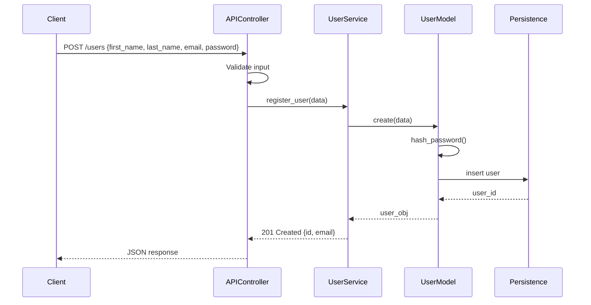
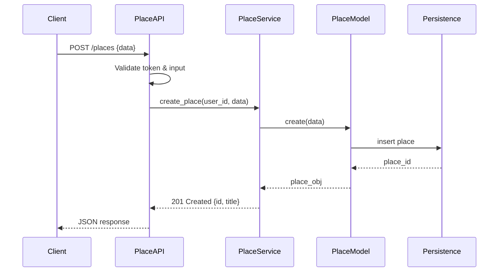
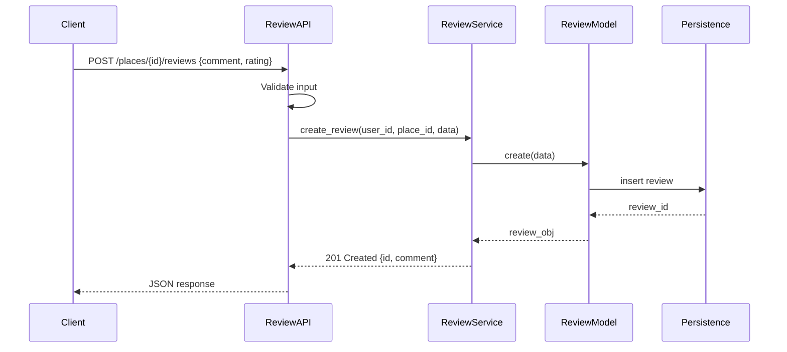
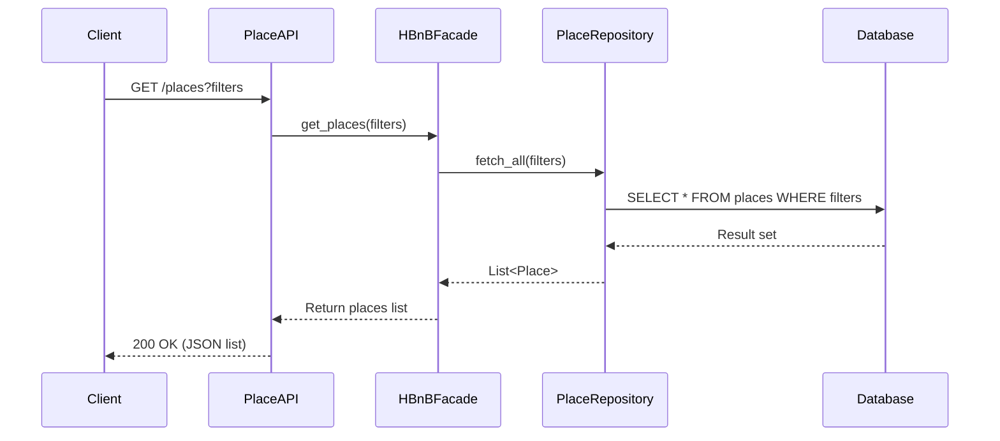

## 1. User Registration :

```mermaid
sequenceDiagram
    participant Client
    participant APIController
    participant UserService
    participant UserModel
    participant Persistence

    Client->>APIController: POST /users {first_name, last_name, email, password}
    APIController->>APIController: Validate input
    APIController->>UserService: register_user(data)
    UserService->>UserModel: create(data)
    UserModel->>UserModel: hash_password()
    UserModel->>Persistence: insert user
    Persistence-->>UserModel: user_id
    UserModel-->>UserService: user_obj
    UserService-->>APIController: 201 Created {id, email}
    APIController-->>Client: JSON response
```

## 2. Place Creation :

```mermaid
sequenceDiagram
    participant Client
    participant PlaceAPI
    participant PlaceService
    participant PlaceModel
    participant Persistence

    Client->>PlaceAPI: POST /places {data}
    PlaceAPI->>PlaceAPI:Validate token & input
    PlaceAPI->>PlaceService: create_place(user_id, data)
    PlaceService->>PlaceModel: create(data)
    PlaceModel->>Persistence: insert place
    Persistence-->>PlaceModel: place_id
    PlaceModel-->>PlaceService: place_obj
    PlaceService-->>PlaceAPI: 201 Created {id, title}
    PlaceAPI-->>Client: JSON response
```

## 3. Review Submission :

```mermaid
sequenceDiagram
    participant Client
    participant ReviewAPI
    participant ReviewService
    participant ReviewModel
    participant Persistence

    Client->>ReviewAPI: POST /places/{id}/reviews {comment, rating}
    ReviewAPI->>ReviewAPI: Validate input
    ReviewAPI->>ReviewService: create_review(user_id, place_id, data)
    ReviewService->>ReviewModel: create(data)
    ReviewModel->>Persistence: insert review
    Persistence-->>ReviewModel: review_id
    ReviewModel-->>ReviewService: review_obj
    ReviewService-->>ReviewAPI: 201 Created {id, comment}
    ReviewAPI-->>Client: JSON response
```

## 4. Fetching a List of Places :

```mermaid
sequenceDiagram
    participant Client
    participant PlaceAPI
    participant HBnBFacade
    participant PlaceRepository
    participant Database

    Client->>PlaceAPI: GET /places?filters
    PlaceAPI->>HBnBFacade: get_places(filters)
    HBnBFacade->>PlaceRepository: fetch_all(filters)
    PlaceRepository->>Database: SELECT * FROM places WHERE filters
    Database-->>PlaceRepository: Result set
    PlaceRepository-->>HBnBFacade: List<Place>
    HBnBFacade-->>PlaceAPI: Return places list
    PlaceAPI-->>Client: 200 OK (JSON list)
```
