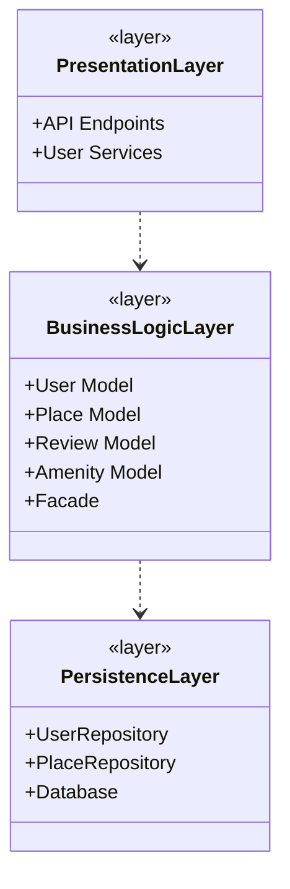
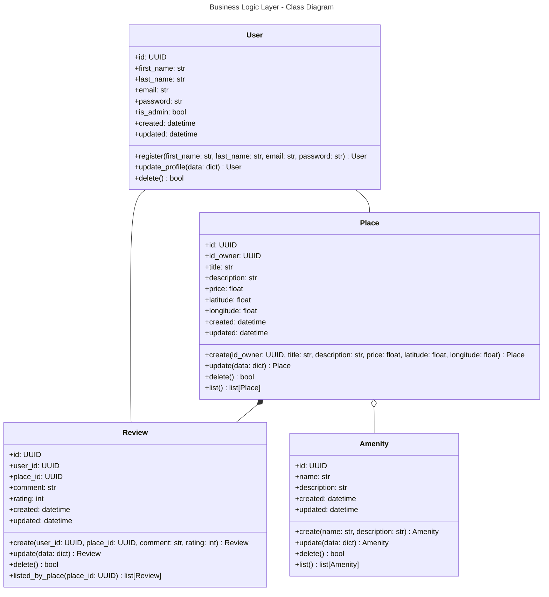
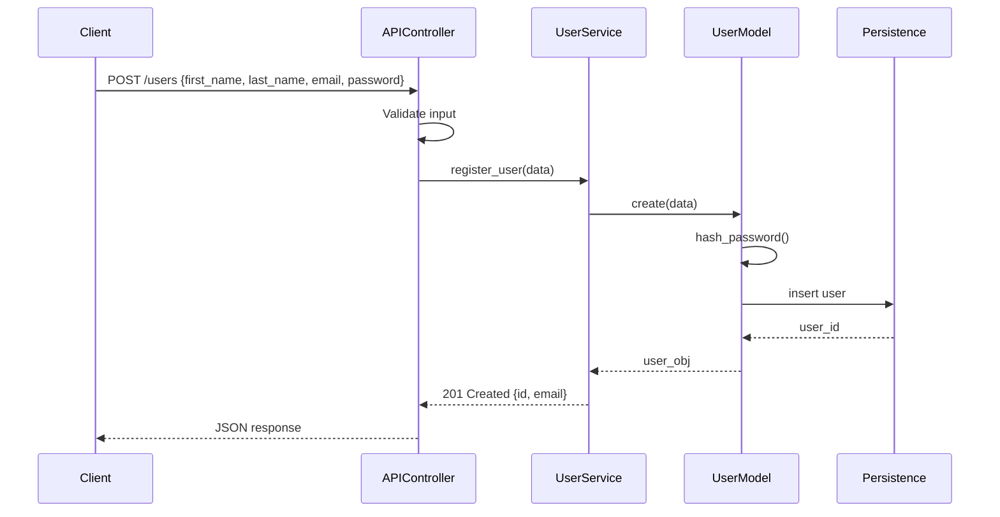
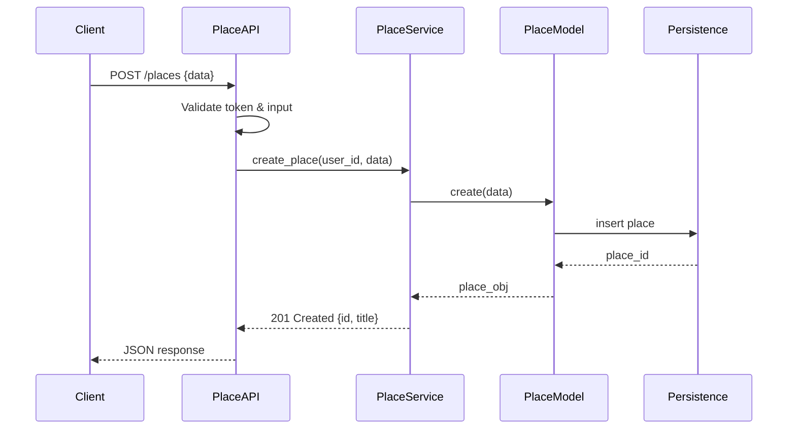
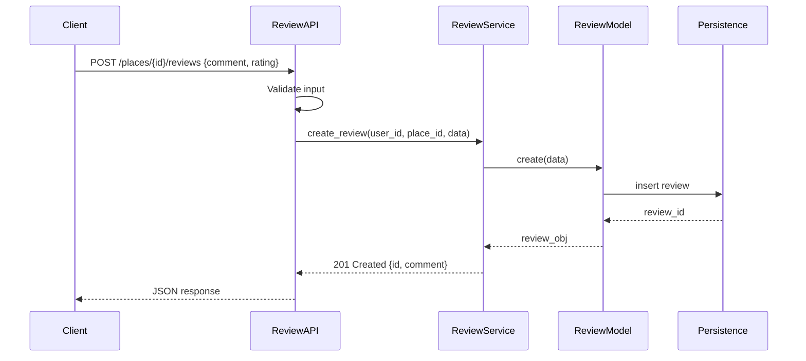
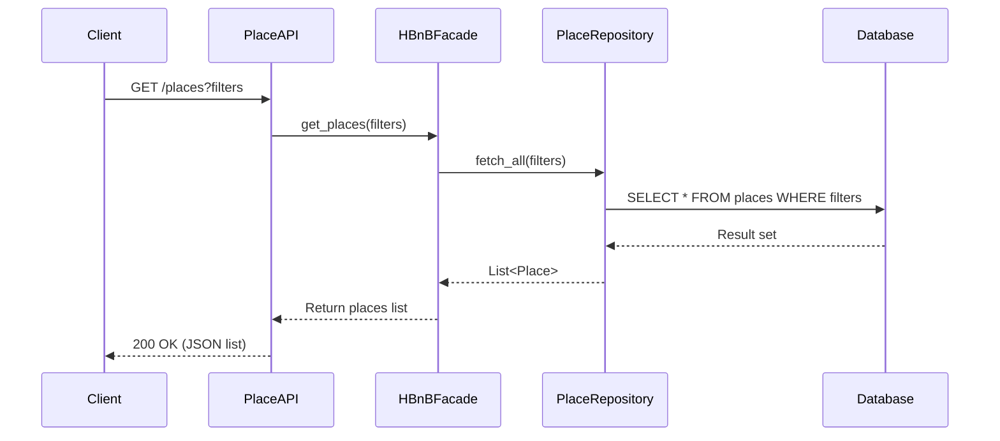

# Document de Spécification Technique : Projet HBnB

## 1. Introduction

Ce document constitue le schéma directeur du projet HBnB, une application de type place de marché pour la location de logements. Son but est de fournir une vision claire et détaillée de l'architecture logicielle, des modèles de données et des flux de communication pour guider les développeurs lors de la phase d'implémentation.

Le document est divisé en trois sections majeures : l'architecture globale, la logique métier détaillée et les flux d'interactions API.

## 2. Architecture de Haut Niveau (High-Level Architecture)

### 2.1 Diagramme de Paquetages

Cette section présente l'organisation structurelle de l'application basée sur une architecture en couches.

### 2.2 Composants et Rationale

   **- Couche Présentation (PresentationLayer) :** Expose les points de terminaison REST. Elle est responsable de la réception des requêtes HTTP et de la validation syntaxique.

   **- Façade (Facade) :** Ce composant implémente le Pattern Façade. Il sert de point d'entrée unique pour la logique métier, orchestrant les appels complexes pour simplifier l'interface exposée à l'API.

   **- Couche Logique Métier (BusinessLogicLayer) :** Contient les entités fondamentales et les modèles principaux (User Model, Place Model, Review Model, Amenity Model, Facade).

   **- Couche Persistance (PersistenceLayer) :** Gère l'abstraction du stockage. Elle contient UserRepository, PlaceRepository et Database, et permet de changer de moteur de base de données sans impacter la logique métier.

   **- Base de Données :** Couche finale de stockage physique des données.

## 3. Couche Logique Métier (Business Logic Layer)

### 3.1 Diagramme de Classes Détaillé

Le diagramme suivant illustre la structure des objets métier et leurs interdépendances.

### 3.2 Entités et Relations Clés

   **- Utilisateur (User) :** Gère l'identité (email, mot de passe haché) et le rôle (admin).
   **- Logement (Place) :** L'entité centrale. Elle possède une relation de possession avec l'Utilisateur (propriétaire) et une relation de composition avec les Équipements.
   **- Avis (Review) :** Relie un Utilisateur à un Logement avec une note et un commentaire.
   **- Équipement (Amenity) :** Caractéristiques optionnelles d'un logement.

## 4. Flux d'Interaction API (API Interaction Flow)

### 4.1 Diagramme de Séquence - User Registration :

1. Réception : Le client envoie une requête POST pour créer un nouvel utilisateur.
2. Validation : L'API vérifie la syntaxe et l'intégrité des données (email valide, mot de passe, etc.).
3. Création : La requête est transmise au UserService qui crée l'entité User et effectue le hachage du mot de passe.
4. Persistance : L'utilisateur est inséré dans la base vie la couche de persistance.
5. Réponse : L'API renvoie le code 201 Created avec les informations de l'utilisateur créé.

### 4.2 Diagramme de Séquence - Place Creation :

1. Réception: Le client envoie une requête POST pour créer un logement.
2. Validation : L'API vérifie le token utilisateur et les données fournies.
3. Création : La requête est transmise au PlaceService qui crée l'entité Place.
4. Persistance : Le logement est enregistré via la couche Persistence.
5. Réponse : L'API renvoie un code 201 Created avec l'ID et le titre du logement.

### 4.3 Diagramme de Séquence - Review Submission :

1. Réception : L'utilisateur soumet un avis sur un logement via un requête POST.
2. Validation : L'API vérifie les champs (commentaire, note).
3. Création : Le ReviewService crée l'entité Review correspondante.
4. Persistance : L'avis est enregistré dans la base de données via la couche Persistence.
5. Réponse : L'API renvoie un code 201 Created avec l'ID et le commentaire de l'avis.

### 4.4 Diagramme de Séquence - Fetching a List of Places :

1. Réception : L'API reçoit une requête GET avec des filtres pour rechercher des logements.
2. Délégation : La requête est transmise à la façade HBnBFacade pour orchestrer le flux.
3. Extraction : La façade appelle PlaceRepository qui interroge la base de données pour récupérer les logements correspondant aux filtres.
4. Réponse : Les résultats sont envoyés à l'API puis au client sous forme de liste JSON avec un code 200 OK.

## 5. Notes de Conception et Recommandations

   **- Sécurité :** Le hachage des mots de passe est effectué directement dans l'entité Utilisateur (méthode hacher_mot_de_passe).
   **- Identifiants :** Tous les objets utilisent des UUID pour garantir l'unicité globale et faciliter les futures migrations de données.
   **- Extensibilité :** L'architecture permet d'ajouter de nouveaux types de filtres ou de services sans modifier la structure des couches supérieures grâce à l'interface de la façade.
