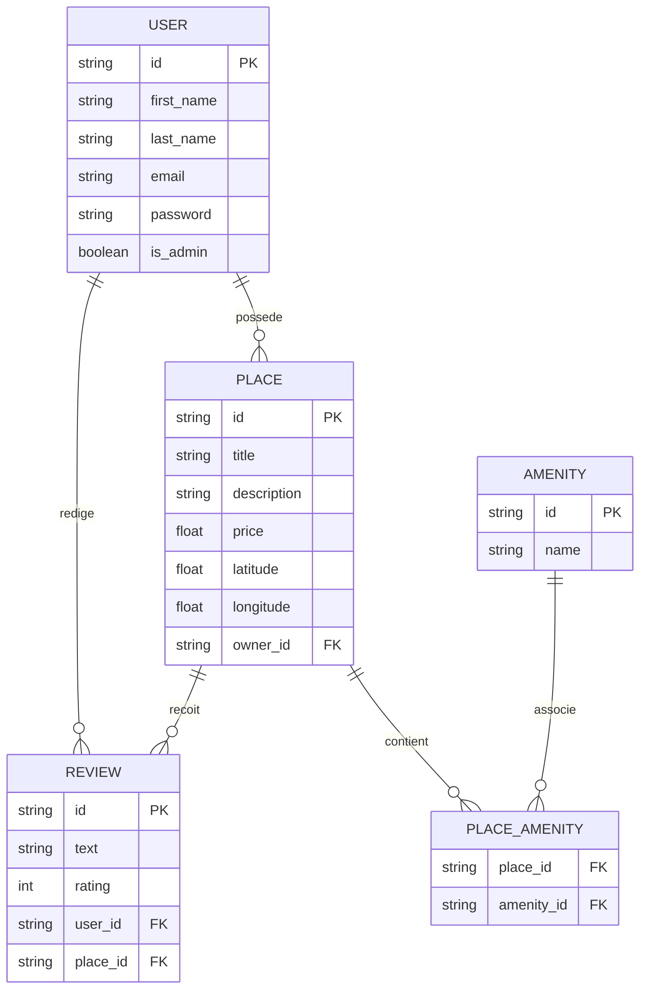

# HBnB - Entity Relationship Diagram

Explications des relations

USER → PLACE (possède)

Type 1 → N

Un utilisateur peut posséder plusieurs logements, chaque logement a exactement un propriétaire.

USER → REVIEW (rédige)

Type 1 → N

Un utilisateur peut écrire plusieurs avis, chaque avis appartient à un seul utilisateur.

PLACE → REVIEW (reçoit)

Type 1 → N

Un logement peut recevoir plusieurs avis, chaque avis est lié à un seul logement.

PLACE ↔ AMENITY via PLACE_AMENITY

Relation many-to-many

Un logement peut avoir plusieurs équipements, un équipement peut être lié à plusieurs logements.

PLACE_AMENITY fait le lien proprement pour éviter la duplication.
